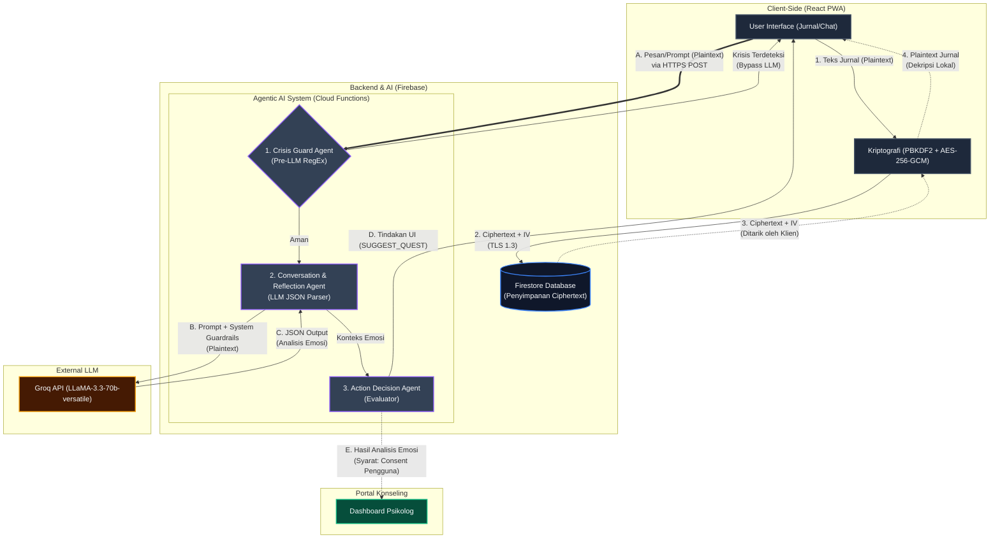

# 🌌 MindQuest — Aplikasi Jurnal Ekspresif Adaptif

MindQuest adalah aplikasi jurnal kesehatan mental interaktif berbasis **PWA** (*Progressive Web App*) yang dirancang untuk remaja akhir dan dewasa muda (18–22 tahun). Aplikasi ini menggabungkan pendekatan *expressive writing*, gamifikasi berbasis RPG, dan *Agentic AI* yang empatik — dibangun di atas fondasi **Zero-Knowledge Encryption** dan metodologi **Secure Software Development Life Cycle (SSDLC)** untuk memastikan privasi absolut pengguna.

MindQuest dikembangkan dengan mengintegrasikan tiga pilar keilmuan sekaligus: psikologi klinis, kriptografi terapan (perlindungan data), dan rekayasa perangkat lunak aman (SSDLC).

---

## 📖 Latar Belakang

Kesehatan mental remaja dan dewasa muda merupakan isu yang terus meningkat urgensinya, sementara akses terhadap dukungan psikologis profesional masih terbatas dan stigma seputar konseling formal tetap tinggi di banyak kalangan. Salah satu intervensi psikologis yang didukung riset ilmiah adalah **Emotional Disclosure Theory** (Pennebaker) — teori bahwa menuliskan emosi dan pengalaman secara terstruktur dapat menurunkan tekanan psikologis dan meningkatkan kesejahteraan emosional, bahkan tanpa kehadiran terapis.

Namun, jurnal digital konvensional memiliki tiga kelemahan utama yang menjadi titik tolak pengembangan MindQuest:

1. **Minim keterlibatan (engagement) jangka panjang** — jurnal pasif cenderung ditinggalkan penggunanya dalam beberapa minggu.
2. **Tidak ada pendamping reflektif** — pengguna menulis tanpa umpan balik yang membantu mereka memahami pola emosinya sendiri.
3. **Risiko privasi data sensitif** — curahan hati yang sangat pribadi umumnya disimpan di server pihak ketiga tanpa jaminan bahwa penyedia layanan (atau pihak yang membobolnya) tidak bisa membaca isinya.

MindQuest menjawab ketiga masalah ini dengan menggabungkan **gamifikasi bermakna** (bukan sekadar poin dan lencana, tapi *quest* yang muncul sesuai kondisi emosional pengguna), **AI pendamping reflektif** yang beroperasi dalam batas etis ketat (tidak pernah mendiagnosis), dan **arsitektur zero-knowledge** di mana bahkan penyedia layanan tidak dapat membaca isi jurnal pengguna.

---

## 🎯 Tujuan

**Tujuan Umum**
Membangun aplikasi jurnal ekspresif adaptif yang aman secara kriptografis dan didukung *Agentic AI* untuk mendukung kesejahteraan emosional pengguna, tanpa menggantikan peran tenaga profesional kesehatan mental.

**Tujuan Khusus**
1. Merancang dan mengimplementasikan sistem *multi-agent AI* yang mampu memberikan refleksi empatik dan mendeteksi sinyal krisis secara *real-time*, dengan batas operasi yang divalidasi psikolog.
2. Mengimplementasikan enkripsi *end-to-end* berbasis AES-256-GCM di sisi klien sehingga data jurnal tidak pernah tersimpan dalam bentuk *plaintext* di server.

---

## ✨ Fitur Utama

### 1. Solusi Arsitektur Agentic AI (MindQuest AI)

Pusat interaksi aplikasi ini ditenagai oleh **Agentic AI** berbasis **Groq API** dengan model **LLaMA-3.3-70b-versatile**, dipilih menggantikan Gemini API karena pertimbangan kecepatan inferensi. AI di MindQuest tidak sekadar merespons teks sebagai *chatbot* biasa, melainkan dirancang sebagai **Multi-Agent System** (sistem multi-agen) dengan pendekatan *Agentic Workflow* yang berjalan terisolasi di sisi *backend* (Firebase Cloud Functions).

Filosofi utama AI di sini adalah sebagai **pendamping reflektif**, bukan pengganti tenaga profesional. Oleh karena itu, interaksi pengguna dikelilingi oleh 5 lapis *Guardrails* (pagar pengaman) *defense-in-depth* guna memitigasi risiko halusinasi, injeksi prompt, atau saran klinis yang berbahaya.

#### 1.1 Tiga Agen Utama dalam Arsitektur Agentic (Multi-Agent System)
Pemrosesan AI dipecah menjadi tiga lapisan agen yang dieksekusi secara sekuensial:

**A. Crisis Guard Agent (Filter Deterministik Pre-LLM)**
- Bertindak sebagai pengaman pertama lapis depan (*fail-safe*) sebelum pesan mencapai LLM.
- Menggunakan pendekatan deterministik berbasis *RegEx* untuk mendeteksi sinyal krisis darurat secara pasti (contoh: "ingin mati", "lelah hidup").
- **Tindakan**: Jika sinyal terdeteksi, agen ini **menginterupsi dan memutus** alur panggilan ke LLM secara total, lalu langsung mengambil alih untuk memancarkan *distress response* standar berisi *hotline* krisis profesional (119 ext 8 Into The Light). Agen independen ini menghindarkan AI dari kesalahan interpretasi konteks nyawa pengguna.

**B. Conversation & Reflection Agent (Core LLM)**
- Mengelola alur *natural language* dan berperan sebagai teman sejawat (karakter "Rusa Berbintang").
- Menerapkan **Injeksi Konteks Dinamis**: menyematkan informasi tren riwayat emosi pengguna ke dalam memori sesi (*System Prompt*) agar AI dapat memahami secara personal.
- Memiliki **Output Parsing Guardrails**: Mewajibkan luaran (*output*) LLM dalam format JSON murni. Jika LLM berhalusinasi dan gagal mengembalikan JSON, sistem dirancang *fail-safe* dengan menyematkan pesan cadangan ("koneksi batinku terganggu") alih-alih mengalami *crash*.

**C. Action Decision Agent (Evaluator Post-LLM)**
- Agen ini yang membuat sistem benar-benar bersifat *"Agentic"*. Tugasnya adalah mengevaluasi hasil akhir dari LLM lalu merumuskan tindakan konkret (*Action Payloads*) yang akan mengeksekusi instruksi di sisi *frontend/UI*.
- **Contoh Eksekusi**: Terlepas dari respons ramah LLM hari ini, agen ini membaca *state* historis. Jika sistem mencatat emosi memburuk selama ≥3 hari (`consecutiveNegativeDays`), agen secara independen akan menembakkan instruksi `SUGGEST_TREND_CHECKIN` yang menginstruksikan UI untuk memberikan penawaran obrolan lebih dalam.

#### 1.2 State Machine & Batasan Etis (Prompt-Level Guardrails)
Logika "otak" AI dikunci secara ketat (lewat `systemPrompt.js`) untuk mematuhi regulasi intervensi mental:
- **Anti-Diagnosis & Anti-Judging**: Sebagai *hard constraint*, AI dilarang mutlak mencetuskan istilah diagnosis klinis (depresi, psikosis) demi mencegah *self-diagnosis* pengguna, serta dilarang merespons dengan gaya menghakimi.
- **Fase Percakapan Terstruktur**: AI beroperasi dengan *state machine* otomatis yang menavigasi sesi dari:
  1. `deepening`: Memancing pengguna bercerita bebas.
  2. `clarify`: Memilah emosi yang campur aduk.
  3. `request_score`: Ketika kondisi memuncak, AI secara mandiri menyerahkan kendali pada pengguna untuk memilih skor emosinya (1-10) alih-alih menilai sendiri secara prematur.
  4. `scoring`: Evaluasi final sebelum klasifikasi dicocokkan ke kerangka *Plutchik's Wheel of Emotions*.

#### 1.3 Keamanan Pintu Masuk (Infrastructure Guardrails)
Kerentanan berbasis LLM *(OWASP Top 10 for LLM Applications)* dimitigasi sejak level pintu masuk API (*Cloud Functions*):
- **Payload Size Limiter**: Mengeblok masukan teks yang melewati 5.000 karakter, mematikan potensi eksploitasi *Prompt Injection* dan memangkas kelebihan biaya token.
- **Rate Limiting In-Memory**: Membatasi 10 kueri per menit per IP untuk melindungi *endpoint* dari insiden DoS atau *spamming*.
- **Firebase Auth Guard**: Otentikasi absolut. Penyerang di luar aplikasi dilarang memanggil *endpoint* karena validasi Token Autentikasi Firebase wajib terpenuhi.

Lapisan arsitektur AI ini divalidasi dan diuji melalui skenario pengujian kerentanan (*Proof of Concept - PoC 02*) pada riset SSDLC proyek.

### 2. Kriptografi Zero-Knowledge (AES-256-GCM)
Teks jurnal dan keluhan pengguna tidak pernah menyentuh server dalam bentuk *plaintext*.
- Data dienkripsi secara lokal di perangkat klien menggunakan **Web Crypto API**.
- Server (Firestore) hanya menerima, menyimpan, dan mengirimkan *ciphertext* acak dan *Initialization Vector* (IV).
- Komunikasi klien–server dilapisi **TLS 1.3**.
- **Alat Uji Dekripsi Manual (Live)** tersedia di dalam aplikasi (Mode Developer rahasia) untuk membuktikan keaslian proses pembongkaran sandi secara waktu nyata tanpa bergantung pada koneksi/cache.

### 3. Keamanan SSDLC (Microsoft SDL) & Pengujian PoC
Pengembangan aplikasi ini menerapkan metodologi *Secure Software Development Life Cycle* berbasis **Microsoft SDL**, dengan skor maturitas keseluruhan **79%**.
- Pemodelan ancaman (*Threat Modeling*) dengan metodologi **STRIDE** dan konstruksi **Attack Tree** (AT-01 s.d. AT-04) spesifik untuk arsitektur hibrida PWA dan LLM — AT-01 (Eksfiltrasi Data Jurnal) divisualisasikan mencakup 20 *leaf nodes* serangan.
- *Static Application Security Testing* (SAST) menggunakan **Semgrep** dan **njsscan**.
- Tiga *Proof of Concept* (PoC) terintegrasi untuk membuktikan mitigasi:
  - **PoC-01** — Firestore Rules
  - **PoC-02** — Cloud Function (AI Agent) — validasi terhadap eksfiltrasi dan manipulasi prompt
  - **PoC-03** — Eksfiltrasi via Cache Browser (PWA)

### 4. Portal Konseling Anonim & Live Chat
MindQuest menghubungkan pengguna dengan psikolog profesional secara langsung tanpa memerlukan pengungkapan identitas asli.
- Memanfaatkan autentikasi anonim (*Anonymous Auth*).
- Psikolog memiliki dasbor khusus (*Portal Psikolog*) dengan antarmuka bernuansa *space-glassmorphism* yang memuat antrean klien secara *real-time*.
- Fitur *Live Chat* terenkripsi untuk sesi konseling jarak jauh.

### 5. Jurnal Batin & PWA
- Pencatatan jurnal dengan pemantauan skor emosi (1–10) setiap harinya.
- Visualisasi tren fluktuasi emosi pengguna menggunakan grafik interaktif 14 hari terakhir.
- **Dukungan Offline (PWA)** melalui *Service Worker* (Workbox) yang memungkinkan aplikasi diakses dan *caching* data secara luring. Strategi *caching* diatur secara ketat (*NetworkOnly* untuk API AI) demi mencegah kebocoran data sensitif (*mitigated PWA cache leak*).

### 6. Estetika "Hutan Jiwa" (Dark Space Theme)
Antarmuka didesain menggunakan filosofi visual yang menenangkan, menghilangkan kekakuan aplikasi medis konvensional:
- **Latar:** `midnight` dan `space-deep` untuk kesan ketenangan dan keluasan kosmos.
- **Warna Aksen:** pendaran bintang `gold` dan tekstur gulungan kuno `vellum`.
- **Micro-animations:** elemen kaca transparan (*glassmorphism*) dan interaksi tombol halus untuk pengalaman premium.

---

## 🏗️ Arsitektur Sistem

**Tumpukan Teknologi:**

| Lapisan | Teknologi |
|---|---|
| Frontend | React.js + Phaser.js (gamifikasi RPG) |
| Backend / Infrastruktur | Firebase (Firestore + Cloud Functions) |
| Kecerdasan Buatan | Groq API — LLaMA-3.3-70b-versatile (arsitektur multi-agent) |
| Enkripsi | AES-256-GCM via Web Crypto API |
| Transport | TLS 1.3 |
| PWA / Offline | Service Worker (Workbox) |
| Keamanan Kode | Semgrep, njsscan (SAST) |

**Diagram Arsitektur Multi-Agent & Kriptografi:**


**Alur Data Ringkas:**
Terdapat **dua jalur terpisah** untuk memastikan privasi (E2EE) tetap terjaga sambil memungkinkan interaksi AI:

1. **Jalur Penyimpanan Jurnal (E2EE):**
   - Pengguna menulis entri jurnal di klien (React PWA).
   - Teks (Plaintext) dienkripsi secara lokal (AES-256-GCM dengan kunci dari PBKDF2) sebelum meninggalkan perangkat.
   - *Ciphertext* + IV dikirim via TLS 1.3 ke Firestore. Server tidak pernah melihat dan tidak bisa mendekripsi isi jurnal.
   - Saat pengguna mengakses riwayat, *ciphertext* ditarik kembali dan didekripsi di klien.
2. **Jalur Analisis Emosi (Transient):**
   - Secara terpisah, untuk interaksi AI, UI mengirim teks jurnal/obrolan (*plaintext*) ke Cloud Function melalui HTTPS POST.
   - Teks ini hanya singgah sementara di memori server (tidak disimpan) untuk diproses oleh *multi-agent system* (termasuk LLaMA-3.3-70b-versatile) dan dikirimkan ke Groq API.
   - Respons AI dan status emosi dievaluasi oleh *Action Decision Agent* yang kemudian menentukan tindakan aplikasi (eksplorasi → pemantauan → quest → rujukan psikolog).
3. **Portal Psikolog:** Hasil analisis emosi (seperti tren *mood* atau sinyal krisis) dari AI diteruskan ke Dashboard Psikolog **hanya jika** pengguna telah memberikan persetujuan (*consent*). Jurnal mentah tetap terenkripsi dan tidak bisa dibaca oleh psikolog kecuali klien membagikannya secara manual.

---

## 📊 Rencana Evaluasi

| Aspek | Instrumen / Metrik | Target |
|---|---|---|
| Usabilitas | System Usability Scale (SUS) | *TBD* |
| Kepuasan klien | Client Satisfaction Questionnaire (CSQ-8) | *TBD* |
| Akurasi deteksi emosi | F1-Score | ≥ 80% |
| Kualitas enkripsi | Shannon Entropy | ≥ 7.9 bit/byte |

> Target SUS dan CSQ-8 masih menunggu penetapan nilai ambang batas dan akan dilengkapi terpisah.

---

## 🚀 Panduan Instalasi & Menjalankan Aplikasi

Aplikasi ini dibangun menggunakan tumpukan **React + Vite + Firebase (Firestore & Cloud Functions)**.

### 1. Prasyarat
- Node.js (minimal v18)
- Akun Firebase (dengan konfigurasi Cloud Functions & Firestore)

### 2. Instalasi
Buka folder repositori, lalu jalankan:
```bash
npm install
```

### 3. Konfigurasi Variabel Lingkungan (.env)
Salin file `.env.example` menjadi `.env` dan isi dengan kredensial dari *Firebase Console* Anda:
```env
VITE_FIREBASE_API_KEY=AIza...
VITE_FIREBASE_AUTH_DOMAIN=mindquest-xxxx.firebaseapp.com
VITE_FIREBASE_PROJECT_ID=mindquest-xxxx
VITE_FIREBASE_STORAGE_BUCKET=mindquest-xxxx.appspot.com
VITE_FIREBASE_MESSAGING_SENDER_ID=123456789
VITE_FIREBASE_APP_ID=1:123456789:web:abcdef
```

### 4. Jalankan Server Pengembangan (Lokal)
```bash
npm run dev
```

---

## 🔒 Menjalankan Backend & Emulator (Untuk Pengujian Keamanan)

Karena arsitektur *Agentic AI* berjalan di **Firebase Cloud Functions**, disarankan untuk menyalakan Firebase Emulator jika Anda ingin menguji rute interaksi AI secara lokal.

### Menyalakan Emulator
```bash
npm run emulators
# atau
npx firebase emulators:start

---

## 🧪 Cara Mendemonstrasikan Dekripsi Manual 
1. Ketuk teks **"Gulungan Memoar"** (pada tab Jurnal) sebanyak 5 kali secara cepat.
2. Klik ikon 🔒 Gembok yang muncul di layar bagian atas hingga berubah warna menjadi Hijau.
3. Buka salah satu entri jurnal (yang terlihat normal/bisa dibaca).
4. *Scroll* ke bagian paling bawah teks — akan muncul kotak **"BUKTI ENKRIPSI"** beserta tombol **Uji Dekripsi Manual**.
5. Salin teks *Ciphertext* acak secara langsung dari *Database Firestore Console* Anda, lalu *paste* ke dalam alat ini untuk membuktikan bahwa data di server benar-benar berantakan, namun aplikasi berhasil membongkarnya di memori lokal.

---

*Dibuat untuk memberikan ketenangan batin yang sejati di dalam Hutan Jiwa.*
